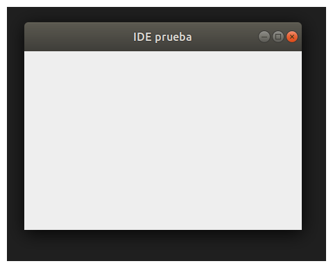

# 2026- TEOI1 - TP1
## UNLu Licenciatura en Sistemas de Información
## Materia: 11412 – Teoría de la Computación I, Plan de estudios: 1713
#### Docente responsable: Capuya Mara Alejandra – Profesor Adjunto
#### Equipo Docente
##### Silvia Cuagliarelli – Jefe de Trabajos Prácticos
##### Eugenia Céspedes – Ayudante de Primera

### Alumnos:
- Daddario Agustín 196658
- Coyra Federico  182939
- Cavallero Jorge Hernán 95807
- Kubisen Joaquín 171779
- Cazeneuve Mario G.L. 168551
### Primera version sin nada en la pantalla SWING

### [Scrapbook imagenes de editores de referencia](./Scrapbook.md)

###  Comandos utiles para construir el proyecto

#### Construir el proyecto

mvn clean package

#### Probar el proyecto

java - jar ./target/tp1-0.0.1-SNAPSHOT.jar

